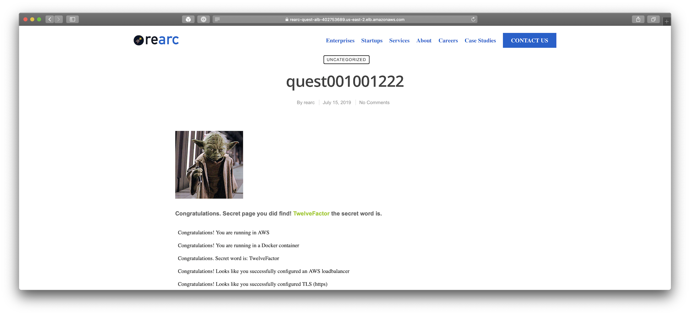

# Rearc Quest | Dockerfile and Terraform | Derek Wolpert

## Overview

The Dockerfile and Terraform templates in this repository make it possible to create and deploy a "dockerized" version of the React Quest application entirely through AWS services. In order to create these resources within your AWS account, both groupings of Terraforms files (``terraform_phase_one`` & ``terraform_phase_two``) are needed, as well as properly installed Terraform and AWS CLI resources with appropriate IAM role access.

### Phase One

Creates a Codebuild project that imports this GitHub repo's latest master branch commit. The included ``buildspec.yml`` and ``Dockerfile`` direct Codebuild to create a Docker image from the latest build of the Rearc Quest application, and pushes the resulting Docker image into an ECR repository for storage and deployment in phase two.

### Phase Two

Creates an ECS cluster - along with container, task, and service definitions, and basic auto scaling configuration - to run the "dockerized" version of the Rearc Quest application. The ECS cluster is routed through a VPC and Loadbalancer with necessary security grouping access (including a self-signed SSL certificate for "mock" HTTPS access) to allow the running container to be accessible on a public facing DNS URL.

## Prerequisites

* Terraform version 0.12 (or greater) installed.

* AWS CLI installed with appropriate IAM role access (e.g. Codebuild, ECR, ECS, logs, etc.).

* AWS access key and secret key stored in their default location, or Terraform configured to know where to find valid credentials. See this AWS resource for details on how to set this up: https://docs.aws.amazon.com/cli/latest/userguide/cli-configure-files.html

* The GitHub webhook connection within the Codebuild project in phase one requires OAuth permissions to be granted. Even though the GitHub repo used for this project is public, you might need to manually grant your AWS account access to GitHub. If you have any issues with this part of setup process, it may be helpful to look over the following resource: https://www.terraform.io/docs/providers/aws/r/codebuild_webhook.html

## Installation / Setup Instructions

### Part 1

1) Download the ``terraform_phase_one`` and ``terraform_phase_two`` directories onto your local device.

### Part 2

1) Navigate a terminal window to the ``terraform_phase_one`` directory.

2) Run the command ``terraform init`` to initialize the needed Terraform configuration files into the working directory.

3) Run the command ``terraform plan`` to review an overview of resources to be created. If there is an issue with the given files Terraform will warn you to correct those issues before proceeding.

4) Run the command ``terraform apply`` to create the resources detailed in the working directory's Terraform files.

### Part 3

1) In a terminal window run the command ``aws codebuild start-build --project-name rearc-quest-codebuild-project`` to instruct your AWS account to create a build.

* NOTE - It can take a few minutes for the build process to be completed. While waiting for the build to propagate to the previously created ECR repo, this may be a great time to run to the bathroom or take a snack break. Only proceed to Part 4 when you have confirmed that a Docker image has been stored in the ECR repository - otherwise Part 4 might fail.

### Part 4

1) Navigate a terminal window to the ``terraform_phase_two`` directory.

2) Repeat the ``terraform init``, ``terraform plan`` and ``terraform apply`` process detailed in Part 2 to create the needed AWS resources.

* Note - It will take a few minutes for these resources to be created. When completed, both a HTTP and HTTPS URL directed towards the project's loadbalancer DNS will be outputted. It will take a few more minutes for the running Docker container on the ECS cluster to be publicly accessible through either the aforementioned HTTP or HTTPS URL.

### Part 5 | Uninstall

1) Navigate a terminal window to the ``terraform_phase_two`` directory and run ``terraform destroy``.

2) Navigate a terminal window to the ``terraform_phase_one`` directory and run ``terraform destroy``.

* Note - It's best to run ``terraform destroy`` for phase two before phase one, as phase two is reliant on the ECR repo in phase one. While comprehensive CI/CD is not implemented at the moment, future adjustments could make this ``terraform destroy`` order imperative to avoid unattended consequences.

## Current Limitations | Possible Improvements

* Ideally there would be only one group of Terraform files needed to be executed. One of the reasons for the current setup was due to an inability to trigger the Codebuild process automatically upon the resource’s creation. Creating the task and container definitions used in phase two when there was no image yet in the ECR repo would cause an error. It should be noted that if a Docker image repo was provided, the phase two Terraform files could be refactored to complete the entire deployment process in one step.

* Comprehensive CI/CD would aid significantly in deployment of this application. At the moment, a new Docker image is created within Codebuild and pushed to the ECR repo when there is a commit to the master branch of the derekwolpert/rearc-quest repo (t would useful if Codebuild was also triggered when there is a new commit to rearc/quest repo). Even if an updated image is placed into the ECR repo, the configured task running on the ECS cluster is not automatically restarted with the updated image. Additionally, does not automatically restart the infrastructure if there is a technical issue along any step of the deployment process. It looks like AWS Codepipeline might be a useful feature to look into to building out detailed CI/CD cycles to address these concerns.

* The current infrastructure setup only takes advantage of basic application autoscaling and loadbalancer configurations in its current setup. Additionally, AWS Fargate engine was utilized to further streamline the process of managing the computing and networking resources. No doubt there would be a benefit to explore manual configurations settings in these regards to improve optimization and allocation of resources.

* The current SSL certificate is self-signed and was created on a local device with openssl. While a self-signed SSL certificate is fine for development/testing purposes, it would NEVER be acceptable for usage with a production web application. Additionally, a self-signed SSL certificate of this typoe will cause a security warning on any modern web browser when navigating to an HTTPS access point. It is possible to circumvent the security warning on some browsers (e.g. Safari), while others (e.g. Chrome) make it significantly more difficult to proceed.